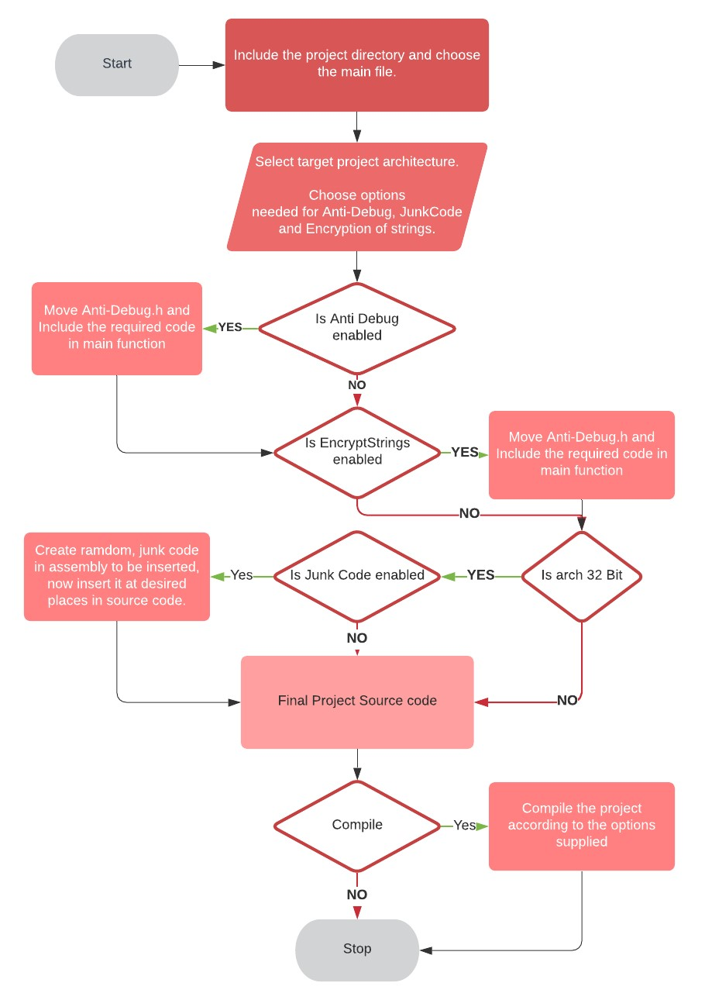

## IMP NOTE:
## 1. Compile in 32 bit VISUAL STUDIO CODE
## 2. Move antidebug.h & encryptstring.h to location of compiled application. (CAN BE FOUND IN DEBUG FOLDER)

-----------------------------------------------------------

# Securing-source-code
A3 Source-Security is a tool with complete graphical interface that makes changes to source code of any application to make it much much more secure. This is done by adding Anti-tampering, Anti-debugging and anti-disassembly capabilities.

## Implementation details:

1.	The main project provides a very customizable GUI for the user to manage the application.
2.	The first thing a user does is import the source code of the application he wants to make changes to and select all the relevant options. 
3.	The main project file provides integration of 3 functionalities into an external project primarily in c++. These 3 functionalities are:
  a.	Adding anti-debugging code
  b.	Encrypting all strings on compile time with a random XOR key
  c.	Adding junk assembly code that changes the structure of code without affecting functionality. 
  4.	After committing all changes, a detailed report for the same is generated.
5.	Furthermore, a user can compile the source code of the application from the project menu itself.

# FLOW CHART

# SEQUENCE DIAGRAM

# FUNCTIONALITIES

## 1.	ANTI-DEBUG

### Individual debug techniques implemented

#### 1.	AntiDebugPresent

This function is a wrapper function around the standard winAPI call 
BOOL IsDebuggerPresent() function which is present in debugapi.h header
As per MSDN https://docs.microsoft.com/en-us/windows/win32/api/debugapi/nf-debugapi-isdebuggerpresent 
IsDebuggerPresent() determines whether the process calling this function is being debugged by some user-mode debugger.

#### 2.	CheckRemoteDebuggerPresent

CheckRemoteDebuggerPresent function (debugapi.h)
This function is used to check whether a remote process is being debugged or not.

Parameters
[in] hProcess
A handle to the process.

[in, out] pbDebuggerPresent
A pointer to a variable that the function sets to TRUE if the specified process is being debugged, or FALSE otherwise.

In order to implement it on the current process, we are first obtaining a handle to a current process and passing it to the win api, and then using the return value to stop or continue the program.

#### 3.	AntiDebugPEB

Process Environment Block is a closed data structure that is used in the Windows NT operating system family. It is a data structure that is to be used by the operating system internally; several of the fields in the PEB structure are not intended for use by the average user. 

PEB structure pointers differ for 32 bit and 64-bit processes.

In order to handle and get the correct PEB for different OS versions as well as application architecture. We have to run checks on several parameters:
1.	Is the application 64 bit or 32 bit
2.	What is the OS version, as the PEB offset might differ for different versions.
3.	Is the process WOW64 (a 32-bit process that is running on a 64-bit operating system)

If the PEB structure offset returns 1 instead of 0, it's confident to assume that a debugger has been attached to it.

#### 4.	CheckNTglobalFlag:

The PEB has another field called NtGlobalFlag (at offset of 0x68) which applications can challenge to identify if they are being debugged or not. Under normal circumstances, when a process is not being debugged by a debugger, the NtGlobalFlag field will contain the value 0x0. 

NtGlobalFlag is located by the the offset of 0x068 and 0x0bc for the x32 and x64 based systems respectively.

After getting the flag value, we can run AND against NT_GLOBAL_FLAG_DEBUGGED, which if successful indicates that the process is being debugged.

#### 5.	Check NtQueryInformationProcess:

This anti-debugging technique has been implemented in only 32 bit code.
This relies on obtaining the NtQueryInformationProcess() process directly from ‘ntdll.dll’ which exports the Windows Native API and is the lowest function available in the userspace.
The NtQueryInformationProcess is an internal operating system function that allows to query the information of a process, in our case we supply the flag

## 2. Encrypt strings

The project aims to overcome this by using templates and compile time random generators to produce an XOR key and then encrypting the string at the compile time itself.

## 3. Junkcode (32 bit inline assembly)
With this technique, the author inserts lots of code whose execution makes no difference to flow of the program, either after unconditional jumps, calls that never return, or conditional jumps with conditions that would never be met. The main goal of this code is to waste the reverse engineer's time analysing useless code or make the code graph look more complicated than it actually is.

